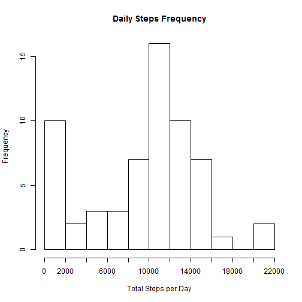
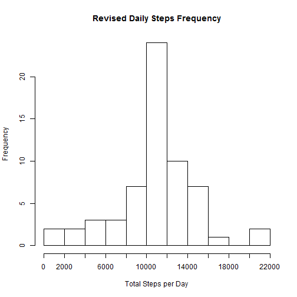
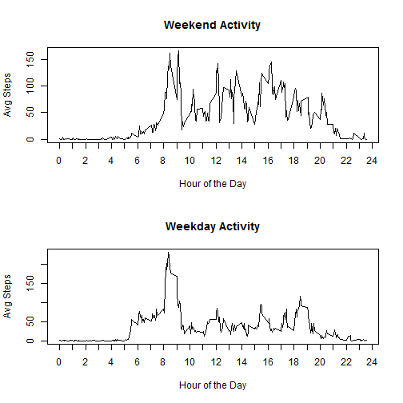

First, we load the data as a csv file.


```r
data <- read.csv("~/coursera/rep_research/activity.csv")
```

Next, we do some initial processing of the data to make it more usable.


```r
totals <- tapply(data$steps, data$date, sum, na.rm=TRUE)
```

This processing gives us an array with the total number of steps for each day. The total number of steps taken over the course of the two months in the data set is given by:


```r
sum(totals)
```

```
## [1] 570608
```

which reveals that 570,608 steps were taken in the two months.

The total number of steps each day is graphically illustrated by a histogram:


```r
hist(totals, breaks=seq(0, 22000, by=2000), xaxt="n", main="Daily Steps Frequency", xlab="Total Steps per Day")
axis(1, at=seq(0, 22000, by=2000))
```



The histogram shows a roughly normal distribution with the exception of a high frequency at the lowest end of the range, which suggests a normal distribution for the majority of days which have normal activity levels and a minority of days with minimal activity. 

The mean and median number of steps per day is similarly calculated using:


```r
mean(totals)
```

```
## [1] 9354.23
```

```r
median(totals)
```

```
## [1] 10395
```

which reveals that the mean number of steps per day is 9,354.23 and the median number of steps per day is 10,395.

The next step is to make a time series plot of the average number of steps taken in each interval of the day. In order to make the graph more comprehensible and useful, I changed the labeling of the x-axis from the interval to the corresponding hour of the day. 

The data needed some initial processing in order to create the time series plot. 


```r
means <- tapply(data$steps, data$interval, mean, na.rm=TRUE)
intervals <- data[1:288, 3]
x <- cbind(intervals, means)
names(x) <- c("intervals", "means")

plot(x, type="l", xaxt="n", main="Daily Activity by Interval", ylab="Average Number of Steps", xlab="Hour of the Day")
axis(1, at=seq(0, 2400, by=100), labels=seq(0, 24, by=1))
```


The five-minute interval with the highest average steps per day is 8:35, given by:


```r
ordered <- x[order(-means),]
ordered[1,1]
```

```
## [1] 835
```

After this initial analysis, I moved on to addressing the problem of missing values. The total number of missing values in the dataset is 2,304 which is given by:


```r
missing <- sum(is.na(data))
missing
```

```
## [1] 2304
```

After determining the number of missing values, I created a new dataset with the missing values filled by the mean of the relevant interval. This dataset is created by the following code:


```r
y <- cbind(data, x[,2])
```

```
## Warning in data.frame(..., check.names = FALSE): row names were found from
## a short variable and have been discarded
```

```r
names(y) <- c("steps", "date", "interval", "means")
y$steps[is.na(y$steps)] <- y$means[is.na(y$steps)]
```

Next I re-created the same histogram created earlier except this time using the new dataset with missing values filled in. Creating the histogram again required some initial processing of the new data.


```r
revised_totals <- tapply(y$steps, y$date, sum, na.rm=TRUE)

hist(revised_totals, breaks=seq(0, 22000, by=2000), xaxt="n", main="Revised Daily Steps Frequency", xlab="Total Steps per Day")
axis(1, at=seq(0, 22000, by=2000))
```



I then determined the new mean and median of the revised dataset:


```r
mean(revised_totals)
```

```
## [1] 10766.19
```

```r
median(revised_totals)
```

```
## [1] 10766.19
```

both of which had the value of 10,766.19, which is higher than the old median and the old mean. 

Next, using the new dataset with the missing values filled in but from before the pre-histogram processing, I created a boolean factor variable whether the day in question is a weekend or not. Creating this variable required first converting the dates in the dataset to the datetime class. 


```r
y$date <- as.POSIXct(y$date)
y$weekdays <- as.factor(weekdays(y$date))
y$weekend <- grepl("Saturday|Sunday", y$weekdays)
```

The final step was to create a two panel time series plot of the average number of steps taken in each interval of the day, one panel for weekdays and one for weekends. As in the previous time series plot, I changed the labeling of the x-axis from the interval to the corresponding hour of the day. Creating this panel plot required significant pre-processing of the data, including creating two datasets, one for weekday data and one for weekend data. 


```r
weekend <- y[(y$weekend) == T, ]
weekday <- y[(y$weekend) == F, ]

weekendMeans <- tapply(weekend$steps, weekend$interval, mean, na.rm=TRUE)
weekendIntervals <- weekend[1:288, 3]
z <- cbind(weekendIntervals, weekendMeans)
names(z) <- c("intervals", "means")

weekdayMeans <- tapply(weekday$steps, weekday$interval, mean, na.rm=TRUE)
weekdayIntervals <- weekday[1:288, 3]
a <- cbind(weekdayIntervals, weekdayMeans)
names(a) <- c("intervals", "means")

par(mfrow=c(2, 1))
plot(z, type="l", xaxt="n", main="Weekend Activity", ylab="Avg Steps", xlab="Hour of the Day")
axis(1, at=seq(0, 2400, by=100), labels=seq(0, 24, by=1))
plot(a, type="l", xaxt="n", main="Weekday Activity", ylab="Avg Steps", xlab="Hour of the Day")
axis(1, at=seq(0, 2400, by=100), labels=seq(0, 24, by=1))
```


